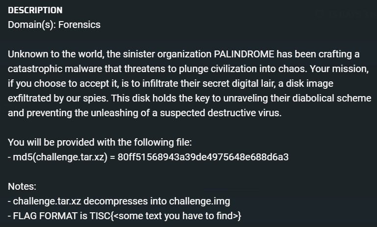
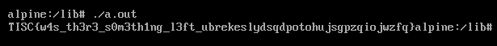

# Disk Archaeology
  

## Strings
Exploring with [strings](./Challenge%201/chal_strings.txt)! What other way to get an easy win than to strings the image and then search for `TISC`?

```
TISC{w4s_th3r3_s0m3th1ng_l3ft_%s}
```

This particular string is found in the image, but the `%s` string formatter hints that the string is used together in a string substitution function, and that this string probably exists in some executable.

## Mounting the Image
We can now attempt to mount the image try to find for the file that contains the `TISC` string.

```bash
mkdir /mnt/challenge 
mount -t ext4 -o loop ./challenge.img /mnt/challenge
```
Trying to grep for "TISC" yields no results.
```bash
grep -rail "TISC" /mnt/challenge/
```
This means that the file likely got deleted and resides in the unallocated space.

## File Carving
We now use PhotoRec to carve out files from the unallocated space, and running `grep` on the carved files shows that there is one `ELF` file that contains the string.

```bash
photorec ./challenge.img
```

After extracting out the [file](./Challenge%201/a.out), I tried to execute it. However it says there is no such file or directory `./a.out`. First time encountering this error...

```bash
./a.out
>> zsh: no such file or directory: ./a.out
```

Running `file` on the executable shows that the interpreter is `/lib/ld-musl-x86_64.so.1`. However, if I try to look for this file on my linux machine (I'm using Kali), there is no such file. Googling this particular library hints that the OS that contains this library is the Alpine Linux OS. 

```bash
file ./a.out
>> ./a.out: ELF 64-bit LSB pie executable, x86-64, version 1 (SYSV), dynamically linked, interpreter /lib/ld-musl-x86_64.so.1, with debug_info, not stripped
```


## Building the Environment for the executable
I [set up a VM with the Alpine Linux OS](https://linuxhint.com/install-alpine-linux-vmware-workstation-17-pro-virtual-machine/#post-334983-_Toc135523648), transferred the executable in, ran it and got the flag!

  

The much easier was probably to download the `ld-musl-x86_64.so.1` file and put it inside my Kali box... 
