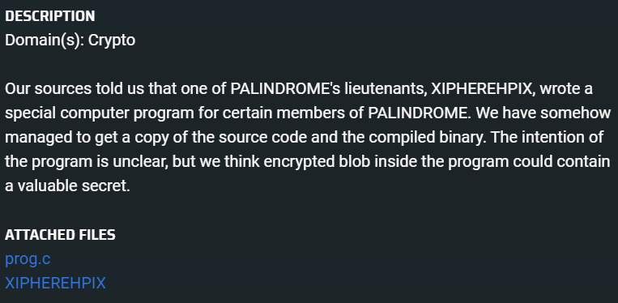

# XIPHEREHPIX's Reckless Mistake
  

## Compiling the program 
```bash
sudo apt-get install libssl-dev
```

```bash
gcc prog.c -o prog.out -lssl -lcrypto
```

## Keyspace is only `2^20`
If we look at the `initialise_key` codeblock, we can see that the key is manipulated by `XOR`-ing it with `arr+counter`. 

```C
void initialise_key(unsigned char *key, char *password, int password_length) {
    const char *seed = "PALINDROME IS THE BEST!";
    int i, j;
    int counter = 0;

    uint256_t *key256  = (uint256_t *)key;

    key256->a0 = 0;
    key256->a1 = 0;
    key256->a2 = 0;
    key256->a3 = 0;

    uint256_t arr[20] = { 0 };

    calculate_sha256((unsigned char *) arr, (unsigned char *) seed, strlen(seed));

    for (i = 1; i < 20; i++) {
        calculate_sha256((unsigned char *)(arr+i), (unsigned char *) (arr+i-1), 32);
    }

    for (i = 0; i < password_length; i++) {
        int ch = password[i];
        for (j = 0; j < 8; j++) {
            counter = counter % 20;

            if (ch & 0x1) {
                accumulate_xor(key256, arr+counter);
            }

            ch = ch >> 1;
            counter++;
        }
    }
}
```

1. Each `arr+i` is fixed and does not change from execution to execution.
2. A key property of `XOR` is that `a XOR b XOR b = a`. This means that we can have `key256 XOR arr+i XOR ... arr + i` but that simplifies to **either** `key256 XOR arr+i` or `key256`.

With these two observations/properties, what we know is that the keyspace is actually only `2^20`. The `key256` is either `XOR`-ed with a particular `arr + i` or not, where `i ∈ [0, 19]`.

We can thus modify the program as [such](./Challenge%202/bruteforcekey.c) to brute force through all the keys.

We modify the main function to loop through all the possible values from `0` to `2^20 - 1`. 

```C
int main(int argc, char **argv)
{
    int MAX_COUNT = pow(2, 20);

    unsigned char key[32];

    for (int i = 0; i < MAX_COUNT; i++) {
        initialise_key(key, i);
        show_welcome_msg(key);
    }
}
```

We then use the binary value of `count` to determine whether or not to `XOR` `arr + i`. The `initialise_key` is simplified from the original function.

```C
void initialise_key(unsigned char *key, int count) {
    const char *seed = "PALINDROME IS THE BEST!";
    int i, j;
    int counter = 0;

    uint256_t *key256  = (uint256_t *)key;

    key256->a0 = 0;
    key256->a1 = 0;
    key256->a2 = 0;
    key256->a3 = 0;

    uint256_t arr[20] = { 0 };

    calculate_sha256((unsigned char *) arr, (unsigned char *) seed, strlen(seed));

    for (i = 1; i < 20; i++) {
        calculate_sha256((unsigned char *)(arr+i), (unsigned char *) (arr+i-1), 32);
    }

    // Only loop through once
    for (; counter < 20; counter++) {
        if (count & 0x1) {
            accumulate_xor(key256, arr+counter);
        }
        count = count >> 1;
    }
}
```

The output of all the welcome messages are [here](./Challenge%202/bfkey.txt).

`TISC{K3ysP4ce_1s_t00_smol_d2g7d97agsd8yhr}`
