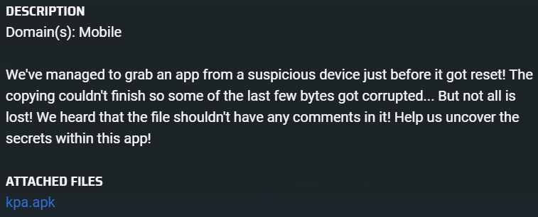
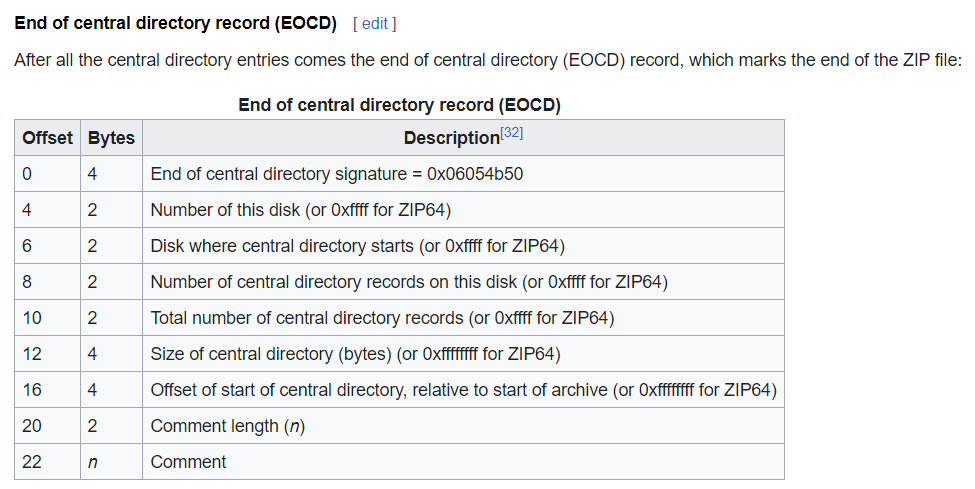
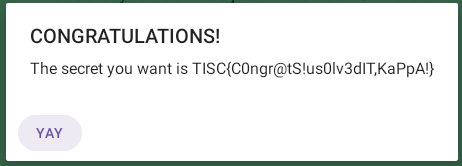

# KPA
  

## No comments

The hint was given that there should be no comments inside the `apk` file, and that the last few bytes are corrupted.

When attempting to decompile the `apk` file using [jadx](https://github.com/skylot/jadx/releases/tag/v1.4.7), there is a signature error. This means that likely some bytes are corrupted which is what the hint is saying.

The `apk` format is essentially a `zip` file. Looking through the `apk` file in hex will show a lot of `PK` headers, which are zip files.

The hint about comments is likely not referring to source code comments as the compiled apk [shouldn't have any comments](https://stackoverflow.com/questions/31976602/are-comments-removed-from-final-apk).

After some research, it seems like `zip` files can contain comments too. Looking at the structure of a `zip` file from [wikipedia](https://en.wikipedia.org/wiki/ZIP_(file_format)), there is a value that indicates the comment length.

  

If we observe the last few bytes of the `apk` file...

```
50 4B 05 06 00 00 00 00 D0 02 D0 02 7D BC 00 00 CB 50 2A 00 0A 00
```

At offset 20 it indicates `0A 00`. Using little-endian encoding to decode this value says that there should be a comment of length `10`. However, there are no more bytes after this block. This means that the value of the comment length should be `00 00` instead.

After fixing it to `00 00`, the file now decompiles properly in `jadx`.


## Setting up the debugging environment
*This [article](https://medium.com/android-news/hacking-android-app-with-frida-a85516f4f8b7) was heavily referenced.*

I first installed set up [`Android-x86`](https://www.android-x86.org/) on VMware. Then I set up [Frida](https://frida.re/) on another VM to interact with the `Android-x86` VM. 


## Bypassing checks and printing the password
There are a few checks we need to bypass: `j1.b.e` and `j1.a.a`. These checks check for the device and installed packages, and we need to bypass them to continue. Using Frida we can patch these two functions to return the values needed to pass the checks.

There is also a reference to `css()` and this value is likely the password needed to get the flag. We can patch the function to `console.log` the `css()` value.

```js
Java.perform(function() {

    // Bypass Device checks
    var jOnebClass = Java.use("j1.b")

    jOnebClass.e.implementation = function (v) {
        console.log("Bypassing Device Checks");
        return false;
    }

    // Bypass Package checks
    var jOneAClass = Java.use("j1.a")

    jOneAClass.a.implementation = function (v) {
        console.log("Bypassing package checks");
        return 20;
    }

    var swClass = Java.use("com.tisc.kappa.sw");

    // Retrieve the password
    swClass.a.implementation = function(v) {
        console.log(swClass.css())
    }
})
```
```bash
[VMware Virtual Platform::com.tisc.kappa ]-> Bypassing Device Checks
Bypassing package checks
ArBraCaDabra?KAPPACABANA!
Bypassing Device Checks
Bypassing package checks
ArBraCaDabra?KAPPACABANA!
```

The password is `ArBraCaDabra?KAPPACABANA!` and upon typing this long string into the application text box, the application will decode the value of the flag:

  
`TISC{C0ngr@tS!us0lv3dIT,KaPpA!}`