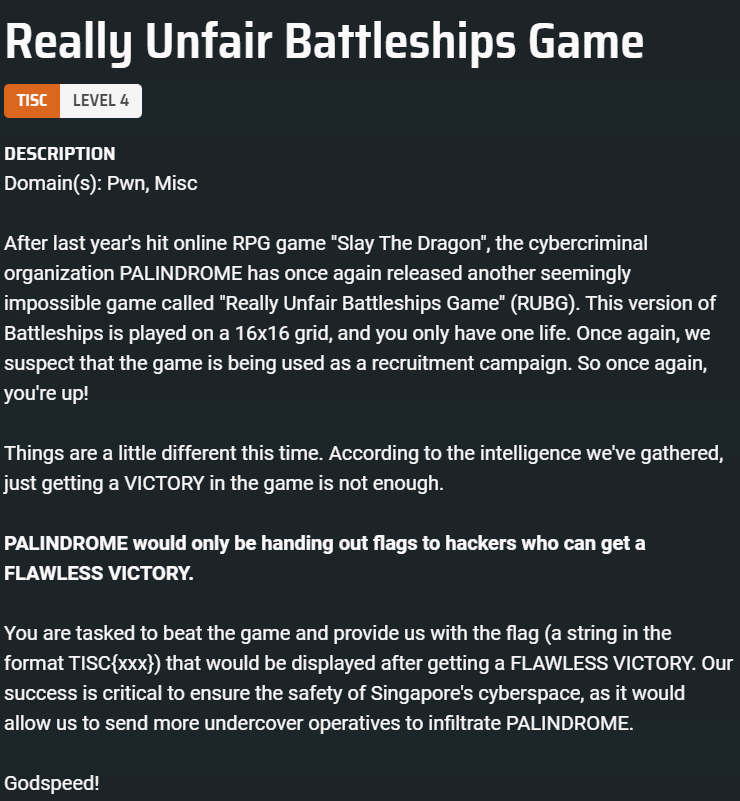
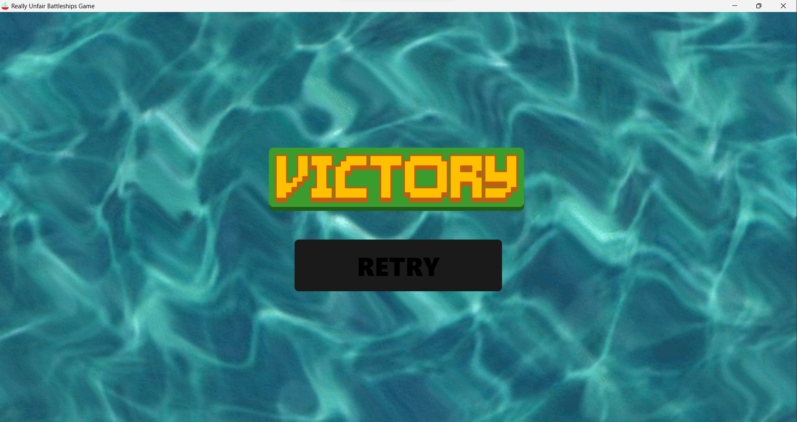

# Really Unfair Battleships Game
  

## Debugging
We are given an executable `rubg_1.0.0.exe`, which I first tried to debug in IDA. Then I realised that when `rubg_1.0.0.exe` executes, a temp folder will be created (This is likely due to the configuration of the nullsoft installer that is being used to *install* the game before executing the main executable in `app-64/rubg.exe`). In the temp folder there is a `.7z` file.  After decompressing it, I browsed the files in `app-64/` and in the `app-64/resources/` directory, there is an `app.asar` file. The application is actually a node.js application, compiled by electron.

It is possible to decompile the `asar` file to obtain the source code:

```cmd
npm install -g asar
mkdir sourecode
asar extract app.asar ./sourcecode
```

The main logic is in [index.js](./Challenge%204/index.js). The code is heavily obfuscated, but there is no need to understand the entire code, we can just run bits and pieces of the code that we want to use.

## Where is the application fetching the battleship configuration?

The application will make a call to `/generate` from `http://rubg.chals.tisc23.ctf.sg:34567`.

```js
async function Hu() {
    return (await Sr.get("/generate")).data
}
```

After getting the values, `E()` will decode the values and manipulate the values.

```js
async function E() {
                i.value = 101;
                let x = await Hu();
                t.value = f(x), n.value = BigInt(x.b), r.value = BigInt(x.c), s.value = x.d, i.value = 1, l.value.fill(0), c.value = [], o.value = ""
            }
```

Finally, `f(x)` will prepare the battleship configuration.

```js
function f(x) {
                let _ = [];
                for (let y = 0; y < x.a.length; y += 2) _.push((x.a[y] << 8) + x.a[y + 1]);
                return _
            }
```

I dumped the entire javascript code from `index.js` into the chrome console. There will be certain errors such as `import.meta.url`, I simply replaced it with some random URL. Then, I made use of the functions to obtain the configuration for the battleships.

### Decoding the configuration for the battleships
After receiving the configuration from `/generate`, `t.value` will hold the result of `f(x)`, which is the parsed configuration.

In a particular case, `t.value` = `{0: 0, 1: 2048, 2: 2048, 3: 2048, 4: 2048, 5: 2048, 6: 56, 7: 0, 8: 1024, 9: 1264, 10: 0, 11: 0, 12: 0, 13: 0, 14: 32768, 15: 32768}`

I read through the logic of how the game determines where the position of the battleships were from this `t.value.` Key represents 0-indexed row. Number represents binary in which battleships appear.
1. `t.value[9] = 1264 = 10011110000`
2. Flip `10011110000` to `00001111001`, then pad with 0s to the right to fill 16 digits `0000111100100000`
3. This means that at row number 9 (0-indexed), the configuration is `0000111100100000`

## Normal Victory
After decoding the configuration, we can now achieve a *normal* victory.

  

## Flawless Victory

To achieve a flawless victory we need to pass this check:

```js
JSON.stringify(c.value) === JSON.stringify([...c.value].sort())
```

`c.value` is created by this weird looking code. 

```js
c.value.push(`${n.value.toString(16).padStart(16,"0")[15-x%16]}${r.value.toString(16).padStart(16,"0")[Math.floor(x/16)]}`)
```

I simply ran it inside the console to obtain the value of `c.value`, and then got the correct answer by running `[...c.value].sort()`.

I then wrote a [python script](./Challenge%204/solve.py) to submit the answer to server.

`TISC{t4rg3t5_4cqu1r3d_fl4wl355ly_64b35477ac}`