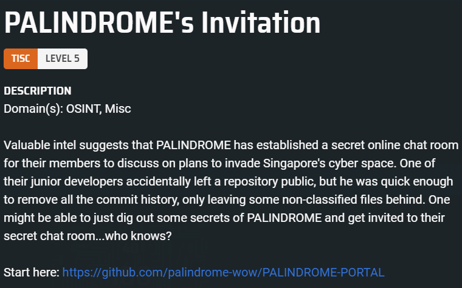
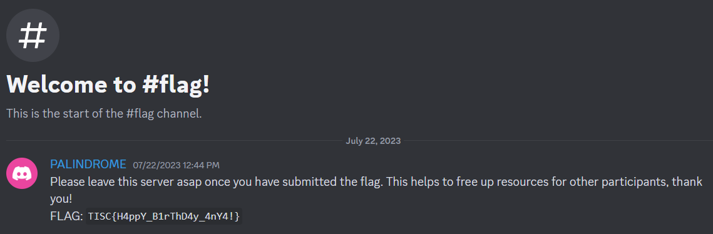

# PALINDROME's Invitation
  


## GitHub Workflow
We start off with a github repository, with a single file `test_portal.yml` inside the `.github/workflows` directory. The `secrets.PORTAL_URL` and `secrets.PORTAL_PASSWORD` are likely repository secrets that cannot be viewed by others. However, since the file is located inside the workflows directory it likely hints that it was used in some github workflow before.

```yml
name: Test the PALINDROME portal

on:
    issues:
        types: [closed]

jobs:
  test:
    runs-on: windows-latest
    steps:
      - uses: actions/checkout@v3
      - name: Test the PALINDROME portal
        run: | 
          C:\msys64\usr\bin\wget.exe '''${{ secrets.PORTAL_URL }}/${{ secrets.PORTAL_PASSWORD }}''' -O test -d -v
          cat test
```

Going to the `Actions` tab leads us to a several workflows, by navigating to the `Test the PALINDROME portal` and to the oldest workflow ran by `palindrome-wow` leads us to some of the [Workflow Logs](https://github.com/palindrome-wow/PALINDROME-PORTAL/actions/runs/6117080632/job/16604234246).

```
--2023-09-08 04:17:14--  (try:20)  ***/:dIcH:..uU9gp1%3C@%3C3Q%22DBM5F%3C)64S%3C(01tF(Jj%25ATV@$Gl
Found chals.tisc23.ctf.sg in host_name_addresses_map (0xa00027870)
Connecting to chals.tisc23.ctf.sg (chals.tisc23.ctf.sg)|18.143.127.62|:45938... Closed fd 4
failed: Connection timed out.
Connecting to chals.tisc23.ctf.sg (chals.tisc23.ctf.sg)|18.143.207.255|:45938... Closed fd 4
failed: Connection timed out.
Releasing 0x0000000a00027870 (new refcount 1).
Giving up.
```

From the `test_portal.yml` template, the `***` we see is likely the URL that is [redacted](https://docs.github.com/en/actions/security-guides/using-secrets-in-github-actions) in the workflow. It looks like GitHub will automatically redact an exact string match of the secret. 

In this case, the connection attempt printed the domain, and not the full URL (i.e., `chals.tic23.ctf.sg:45938` instead of possibly `http://chals.tisc23.ctf.sg:45938`), this caused the `PORTAL_URL` to only be redacted in the initial `***/...` and not the subsequent `wget` logs.

For the `PORTAL_PASSWORD`, it was likely not redacted as it was URL encoded and thus not an exact string match.

Visiting the `http://chals.tisc23.ctf.sg:45938` and entering `:dIcH:..uU9gp1<@<3Q"DBM5F<)64S<(01tF(Jj%ATV@$Gl` as the password will allow us to visit a webpage. The webpage contains a discord invite link to `PALINDROME's secret chat room`. However, upon joining the discord server, it is not possible to read any messages from any of the channels.

There is also a token like string in the HTML comments. It was a temporary token for a discord bot.

```html
<a href=https://discord.gg/2cyZ6zpw7J>Welcome!</a>
<!-- MTEyNTk4MjE2NjM3MTc5NDk5NQ.GGGWRX.-th0HDQZby4EqPCNLTcKJ5qhOWIdJ4YquOzD2Q -->
<!-- You have 15 minutes before this token expires! Find a way to use it and be fast! You can always re-enter the password to get a new token, but please be considerate, it is highly limited. -->
```

## Discord Bot

`curl -H "Authorization: Bot MTEyNTk4MjI5MDY0NDg0NDY1NQ.GfbxYr.cgcsYaHH6q1X0MxxlhQxJo2yfhisn6KcbIY18s" https://discord.com/api/v10/users/@me`

```json
{'id': '1125982290644844655', 'username': "PALINDROME's secretary 5", 'avatar': None, 'discriminator': '5233', 'public_flags': 0, 'flags': 0, 'bot': True, 'banner': None, 'accent_color': None, 'global_name': None, 'avatar_decoration_data': None, 'banner_color': None, 'mfa_enabled': False, 'locale': 'en-US', 'premium_type': 0, 'email': None, 'verified': True, 'bio': ''}
```

After a bit of enumeration:
1. The bot has no way to send messages --> This means that there is likely no exploit to create an invite link using `BetterInvites`.
2. The bot has access to audit logs, and it shows that a lot of users are getting role changes by `BetterInvites` (these users solved the challenge earlier).

The only way this happens is that users are using an invite link, but it is not generated by the user, since the discord bot cannot send messages into the server channels. This meant that the invite links must have been pre-generated.

### Viewing Audit Logs
If we go back to the audit logs, there are a lot of `AuditLogAction.invite_create` and `AuditLogAction.invite_delete` events. We just have to [find a link](./Challenge%205/solve.py) that is active. 

The link that worked is `https://discord.gg/HQvTm5DSTs`.

  

